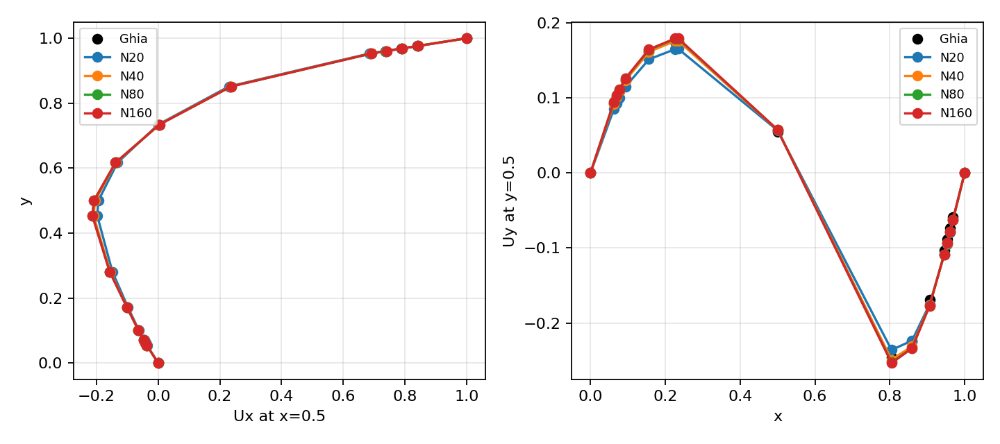
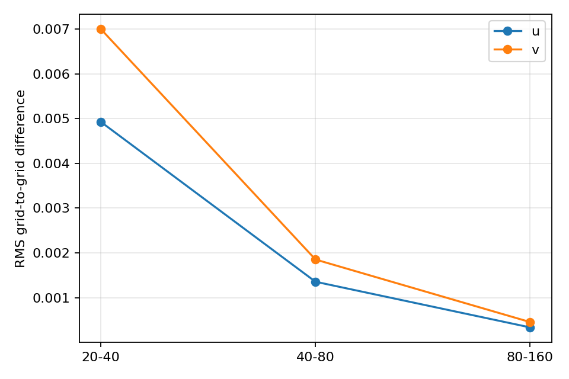
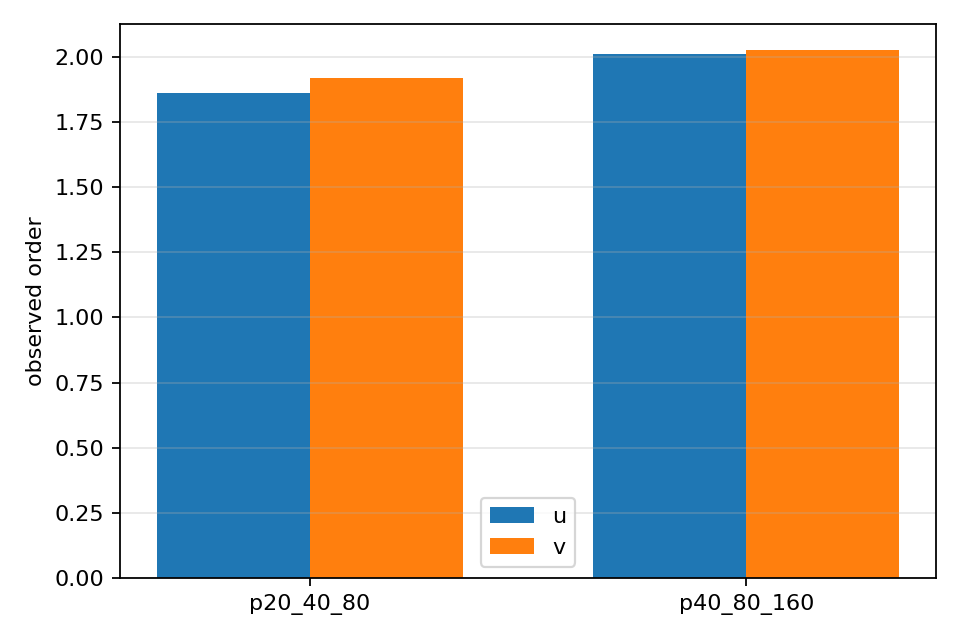
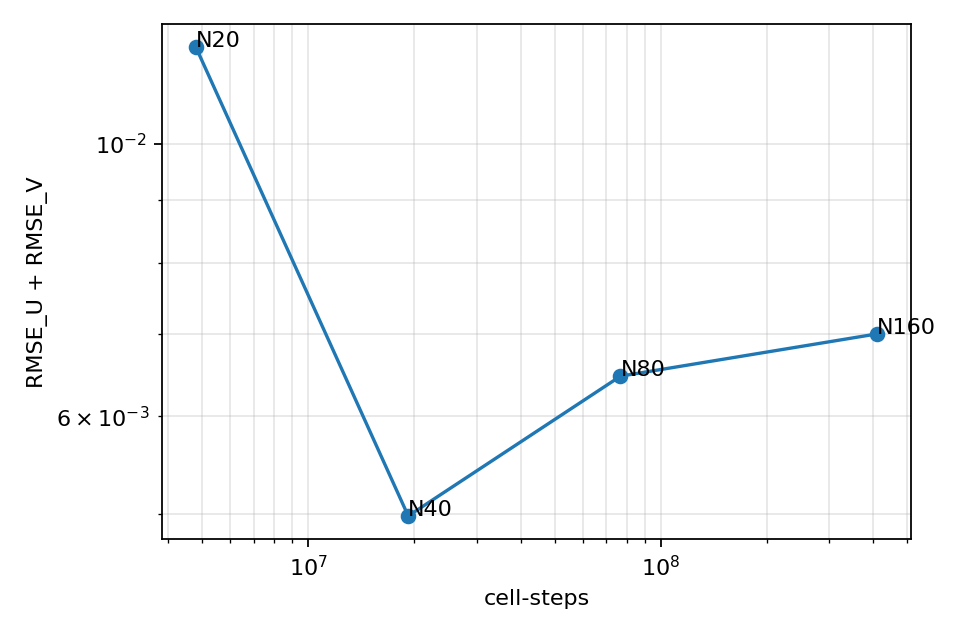
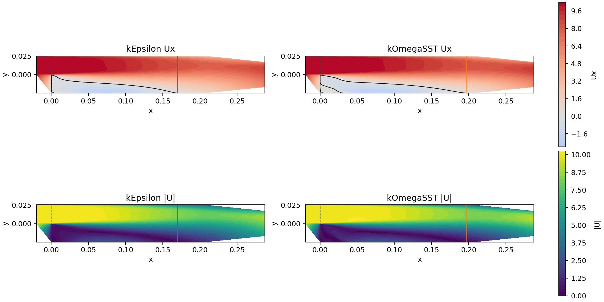
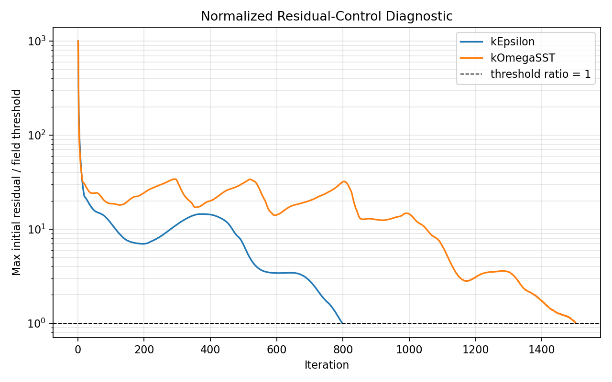
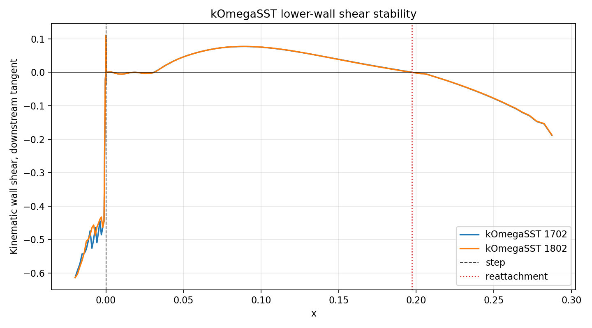

# OpenFOAM CFD Validation Lab: Laminar Cavity Verification and Paired RANS Diagnostics

This repository collects two reproducible OpenFOAM CFD studies for numerical validation and paired model diagnostics. The Re=100 lid-driven cavity component documents a four-grid OpenFOAM-10 validation workflow with exact 17-point centerline sampling and observed centerline self-convergence order from `1.86` to `2.02`.

The Pitz-Daily RANS component is a paired `kEpsilon` / `kOmegaSST` diagnostic using the same mesh, boundary conditions, numerical schemes, and common relaxation configuration. Its public continuation snapshot is `1098 / 1802` iterations with diagnostic status `quality_incomplete_comparison`; it is not a turbulence-model accuracy ranking.

## What This Project Demonstrates

- OpenFOAM case setup for a 2D laminar lid-driven cavity.
- Structured mesh generation with `blockMesh`.
- Mesh-quality inspection with `checkMesh`.
- Transient incompressible solving with `icoFoam`.
- Residual parsing from the solver log.
- Python post-processing of final-time velocity fields.
- Exact point centerline sampling for the validation-v2 results.
- Nearest-cell centerline extraction for smoke-run diagnostics.
- Paired `kEpsilon` / `kOmegaSST` RANS diagnostics on the OpenFOAM `pitzDaily` case.
- Continuation-based RANS public summaries with explicit snapshot separation.
- Shared public export and artifact audit for cavity and RANS outputs.
- Reproducible cloud execution using GitHub Actions and an OpenFOAM Docker image.

<!-- cavity-validation-v2:start -->
## Validation V2 Results

`runs/` contains the untracked full local solver fields and logs for validation-v2. `results/public/` and `figures/` contain the lightweight public CSV summaries and figures exported from those runs.

The validation-v2 runs were generated with OpenFOAM-10. The GitHub Actions OpenFOAM-11 workflow is retained as a smoke reproduction path for the base cavity case, not as the source of the full grid-validation results.

Validation v2 uses exact OpenFOAM `postProcess` point sampling with `cellPoint` interpolation at the 17 Ghia centerline coordinates for each profile. The nearest-cell centerline outputs are diagnostic only and are not used for the formal RMSE summary.

All four grids pass the Courant, fixed-5 steady-state, solver-integrity, and exact-sampling quality gates.

The centerline grid-to-grid differences continuously decrease across the `N20 -> N40`, `N40 -> N80`, and `N80 -> N160` comparisons.

The observed centerline self-convergence order ranges from approximately `1.86` to `2.02`.

The Ghia pointwise RMSE values are not strictly monotonic across the grid sequence. The validation claim is centerline self-convergence, not monotonic benchmark-error convergence.

| N | RMSE_U | Linf_U | RMSE_V | Linf_V | samples U/V | max Co | fixed-5 L2 |
|---:|---:|---:|---:|---:|---:|---:|---:|
| 20 | 0.00508947 | 0.013351 | 0.00689444 | 0.01015 | 17/17 | 0.0420023 | 1.591e-06 |
| 40 | 0.00154198 | 0.003162 | 0.00343663 | 0.007269 | 17/17 | 0.0923108 | 1.576e-06 |
| 80 | 0.00207925 | 0.004691 | 0.00439132 | 0.008699 | 17/17 | 0.192371 | 3.640e-06 |
| 160 | 0.00231236 | 0.004991 | 0.00469103 | 0.009097 | 17/17 | 0.392386 | 7.734e-06 |

Centerline self-convergence is computed on the same 17 exact sample points, not on the full two-dimensional velocity field.

| Profile | d20_40 | d40_80 | d80_160 | p20_40_80 | p40_80_160 | Status |
|---|---:|---:|---:|---:|---:|---|
| u | 0.00492521 | 0.00135554 | 0.000335993 | 1.86131 | 2.01237 | established |
| v | 0.00699835 | 0.00185206 | 0.000455076 | 1.91789 | 2.02495 | established |

Public validation-v2 files:

- `results/public/cavity_validation_v2/validation_summary.csv`
- `results/public/cavity_validation_v2/self_convergence.csv`
- `results/public/cavity_validation_v2/quality_gates.csv`
- `results/public/cavity_validation_v2/manifest.csv`
- `figures/cavity_validation_v2/exact_centerline_vs_ghia.png`
- `figures/cavity_validation_v2/reference_rmse_by_grid.png`
- `figures/cavity_validation_v2/grid_to_grid_difference.png`
- `figures/cavity_validation_v2/observed_order.png`
- `figures/cavity_validation_v2/error_vs_cost.png`








<!-- cavity-validation-v2:end -->

<!-- rans-pitzdaily:start -->
## RANS pitzDaily Paired Diagnostic

This repository also includes a paired RANS model diagnostic for the OpenFOAM `pitzDaily` backward-facing-step tutorial. The diagnostic compares `kEpsilon` and `kOmegaSST` using the same mesh, boundary conditions, numerical schemes, and shared relaxation configuration.

The canonical diagnostic snapshot is the shared +300 iteration continuation under `runs/rans_pitzdaily_formal_v2/stability_continuation/continuation_common/`. The earlier pre-continuation fields are retained only as `historical_pre_stability_snapshot` records in `results/public/rans_pitzdaily/snapshot_registry.json`.

The pre-continuation `conservative_common` runs are the solver-converged baseline: both models triggered SIMPLE convergence and passed solver-integrity, flow-balance, and post-processing quality checks. The public canonical `continuation_common` rows are different: they are fixed +300-iteration QoI stability snapshots advanced from that baseline with `residualControl` disabled. They should not be read as a second SIMPLE-converged solve; their intended use is post-convergence QoI stability audit.

The solver profile and canonical snapshot profile are separate concepts. `results/public/rans_pitzdaily/solver_profile.json` records the common base solver profile as `conservative_common`, while the canonical public snapshot profile is `continuation_common`.

After the fixed +300-iteration continuation, pressure recovery, reattachment location, and lower-wall y+ scalar diagnostics changed by less than 2% over the final 100 iterations. The diagnostic status is `quality_incomplete_comparison` because the full lower-wall shear curve remains the stability boundary: `kEpsilon` passes all QoI stability gates, while `kOmegaSST` has a lower-wall shear curve relative L2 change of `5.19%`, above the preregistered 3% gate.

| Model | Iterations | Pressure recovery | Lower-wall y+ median / p95 | Lr/h | QoI stability |
|---|---:|---:|---:|---:|---|
| kEpsilon | 1098 | 5.038 | 18.91 / 26.71 | 6.68 | passed |
| kOmegaSST | 1802 | 5.442 | 14.19 / 19.54 | 7.76 | wall-shear L2 not passed |







This is a paired RANS model diagnostic and stability-boundary study, not a model-fidelity ranking.

Public RANS diagnostic files:

- `results/public/rans_pitzdaily/diagnostic_model_summary.csv`
- `results/public/rans_pitzdaily/qoi_stability.csv`
- `results/public/rans_pitzdaily/wall_shear_stability_summary.csv`
- `results/public/rans_pitzdaily/quality_gates.csv`
- `results/public/rans_pitzdaily/reattachment_summary.csv`
- `results/public/rans_pitzdaily/run_manifest_public.json`
- `results/public/rans_pitzdaily/snapshot_registry.json`
- `results/public/rans_pitzdaily/solver_profile.json`
- `figures/rans_pitzdaily/field_velocity_comparison.png`
- `figures/rans_pitzdaily/field_model_difference.png`
- `figures/rans_pitzdaily/sst_wall_shear_stability.png`
- `figures/rans_pitzdaily/sst_wall_shear_pointwise_delta.png`
<!-- rans-pitzdaily:end -->

## Smoke Reproduction Outputs

The base tracked outputs under `results/` and `figures/` are smoke-reproduction outputs generated by the GitHub Actions workflow using OpenFOAM Foundation v11.

- `blockMesh` generated the default `40 x 40 x 1` structured cavity mesh with 1600 cells.
- `checkMesh` reports `Mesh OK`.
- `icoFoam` advances the case to `Time = 5s` and exits normally.
- `results/residuals.csv` stores parsed residual histories from `icoFoam.log`.
- `results/centerline_u.csv` and `results/centerline_v.csv` store nearest-cell centerline velocity profiles for diagnostic inspection.
- Generated figures:
  - `figures/cavity_residuals.png`
  - `figures/cavity_centerline_profiles.png`
  - `figures/cavity_velocity_magnitude.png`

These smoke-output centerline profiles are diagnostic outputs extracted from final-time cell-centered values. They are not the formal validation-v2 result.


## Reference Data

The validation-v2 centerline comparisons use the Re=100 reference data from Ghia, Ghia & Shin (1982):

U. Ghia, K. N. Ghia, and C. T. Shin, "High-Re Solutions for Incompressible Flow Using the Navier-Stokes Equations and a Multigrid Method," Journal of Computational Physics 48(3), 387-411. DOI: `10.1016/0021-9991(82)90058-4`.

Reference metadata, source links, and checksums are recorded in `data/reference/source.json`. The repository stores only lightweight tabulated reference values and metadata, not the full paper text.

## Governing Equations

The case uses the incompressible laminar Navier-Stokes equations:

```text
div(U) = 0
dU/dt + div(U U) = -grad(p) + nu laplacian(U)
```

Here `U` is the velocity field, `p` is kinematic pressure, and `nu` is kinematic viscosity.

## Physical Setup

- Geometry: unit square cavity, `0 <= x <= 1`, `0 <= y <= 1`.
- Effective 2D treatment: thin `z` direction with `empty` front/back patches.
- Lid velocity: `U = (1, 0, 0)`.
- Characteristic length: `L = 1`.
- Kinematic viscosity: `nu = 0.01`.
- Reynolds number: `Re = U L / nu = 100`.
- Solver: `icoFoam`.
- The case includes `constant/physicalProperties` and `constant/transportProperties` so the same viscosity is explicit across common OpenFOAM variants.
- The actual OpenFOAM version used for each validation run is recorded in run metadata; the GitHub Actions smoke workflow records the container image in `.github/workflows/reproduce.yml`.

## Mesh

Two mesh contexts are used in this repository:

- Smoke reproduction mesh: `40 x 40 x 1`, used by the base GitHub Actions OpenFOAM-11 workflow.
- Validation-v2 meshes: `20 x 20 x 1`, `40 x 40 x 1`, `80 x 80 x 1`, and `160 x 160 x 1`, used for the OpenFOAM-10 centerline self-convergence study.

The tracked base-case dictionaries are:

- `cases/lid_driven_cavity/system/blockMeshDict.20x20`
- `cases/lid_driven_cavity/system/blockMeshDict.40x40`

`scripts/run_cavity.sh` copies or generates the selected dictionary to `system/blockMeshDict` before running `blockMesh`. Generated OpenFOAM mesh and time directories are reproducible and ignored by git.

## Boundary Conditions

Velocity:

- `top`: moving wall with `U = (1, 0, 0)`.
- `bottom`, `left`, `right`: no-slip walls.
- `frontAndBack`: `empty`.

Pressure:

- Walls: `zeroGradient`.
- `frontAndBack`: `empty`.
- Pressure reference: `pRefCell 0` and `pRefValue 0` in `fvSolution`.

## Reproduction

Local execution requires an OpenFOAM-enabled shell.

Run the base smoke case:

```bash
bash scripts/run_cavity.sh
```

Run the included base mesh resolutions explicitly:

```bash
MESH_RESOLUTION=20 bash scripts/run_cavity.sh
MESH_RESOLUTION=40 bash scripts/run_cavity.sh
```

Run the full validation-v2 workflow locally:

```bash
python scripts/run_cavity_validation_v2.py --overwrite --resolutions 20 40 80 160 --end-times 20 30 40 50 60 70 80
```

Export the lightweight public validation-v2 summaries and figures:

```bash
python scripts/export_validation_v2_public.py
```

Check the required public smoke outputs:

```bash
python scripts/check_outputs.py
```

`runs/` stores untracked local solver fields and logs. The validation-v2 run directory `runs/cavity_validation_v2/` is not tracked by git. The public lightweight validation-v2 results are exported to `results/public/cavity_validation_v2/` and `figures/cavity_validation_v2/`.

The cleanup script removes generated OpenFOAM and post-processing outputs for the base case:

```bash
bash scripts/clean_case.sh
```

## RANS Reproduction

Local RANS execution requires an OpenFOAM-10-enabled shell. The GitHub Actions workflow in this repository is a lightweight cavity smoke workflow; it does not run the full RANS diagnostic study.

Run paired smoke cases:

```bash
MODEL=kEpsilon OVERWRITE=1 bash scripts/run_rans_pitzdaily_case.sh
MODEL=kOmegaSST OVERWRITE=1 bash scripts/run_rans_pitzdaily_case.sh
```

Run the formal paired pitzDaily workflow:

```bash
OVERWRITE=1 bash scripts/run_rans_pitzdaily_formal.sh
```

Run the QoI stability audit on existing formal-run fields:

```bash
python scripts/audit_rans_qoi_stability.py --output-root runs/rans_pitzdaily_formal_v2 --selected-profile conservative_common
```

Run the fixed +300 iteration continuation when the stability audit requires it:

```bash
python scripts/run_rans_qoi_stability_continuation.py --source-root runs/rans_pitzdaily_formal_v2 --output-root runs/rans_pitzdaily_formal_v2/stability_continuation --selected-profile conservative_common --additional-iterations 300 --write-interval 100 --overwrite
```

Export the public RANS diagnostic summaries and figures:

```bash
python scripts/export_rans_diagnostic_public.py
```

Export both public studies and run the public artifact audit:

```bash
python scripts/export_all_public.py
```

The `runs/` directory stores local solver fields and logs and is not tracked by git. Lightweight public RANS CSV/JSON files are written to `results/public/rans_pitzdaily/`; public RANS figures are written to `figures/rans_pitzdaily/`.

## Cloud Reproduction with GitHub Actions

Cloud smoke reproduction with GitHub Actions is provided by the workflow at `.github/workflows/reproduce.yml`. It runs the case using the OpenFOAM 11 Docker image. The workflow runs `blockMesh/checkMesh/icoFoam`, performs Python post-processing and output validation, and uploads `results/` and `figures/` as downloadable run outputs named `openfoam-cavity-results`.

The workflow separates case setup from executed solver results:

- Case setup consists of the tracked OpenFOAM dictionaries and workflow scripts.
- Executed solver results are the logs, CSV files, and figures generated after `blockMesh`, `checkMesh`, `icoFoam`, and Python post-processing run.

Centerline profiles are generated from final-time OpenFOAM field output. The workflow does not require the OpenFOAM `sample` command for required outputs.

## Output Files

Required outputs:

- `results/logs/blockMesh.log`
- `results/logs/checkMesh.log`
- `results/logs/icoFoam.log`
- `results/residuals.csv`
- `results/centerline_u.csv`
- `results/centerline_v.csv`
- `figures/cavity_residuals.png`
- `figures/cavity_centerline_profiles.png`

Optional or best-effort outputs:

- `results/logs/writeCellCentres.log`
- `results/logs/foamToVTK.log`
- `figures/cavity_velocity_magnitude.png`

## Limitations

- The validation scope is limited to the two-dimensional laminar `Re = 100` lid-driven cavity and 17 centerline sample points per profile.
- The validation-v2 conclusions should not be extrapolated to turbulence, complex geometries, industrial meshes, or production CFD workflows.
- The OpenFOAM-11 GitHub Actions workflow is a smoke reproduction for the base case; the full validation-v2 evidence comes from local OpenFOAM-10 runs.
- ParaView is recommended for richer field inspection.
