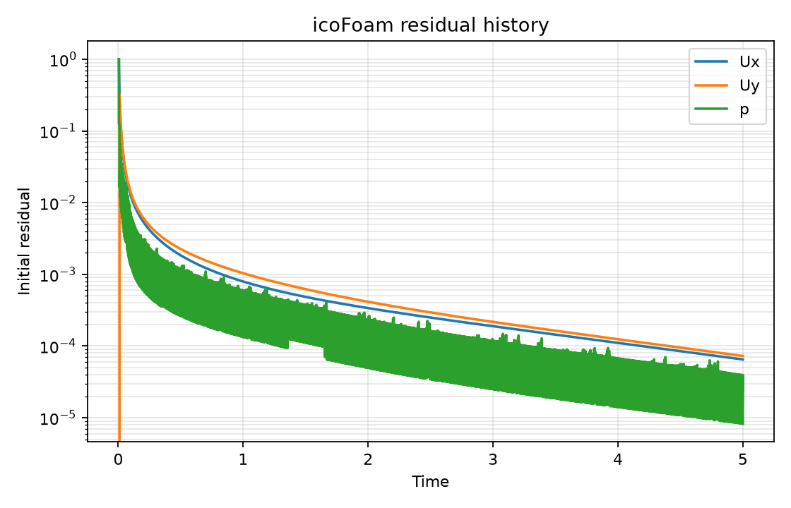
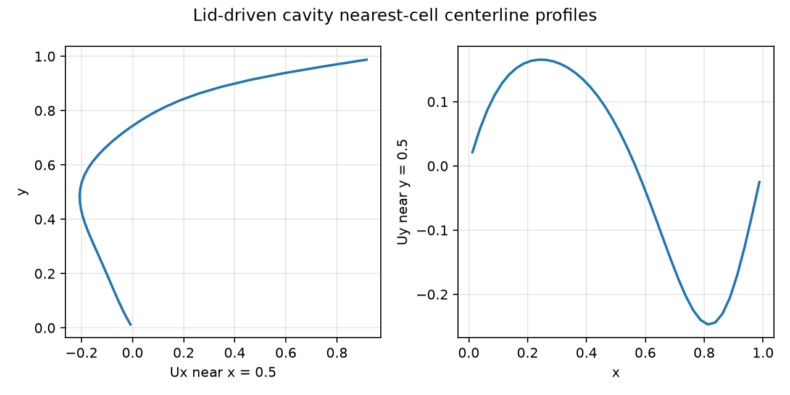
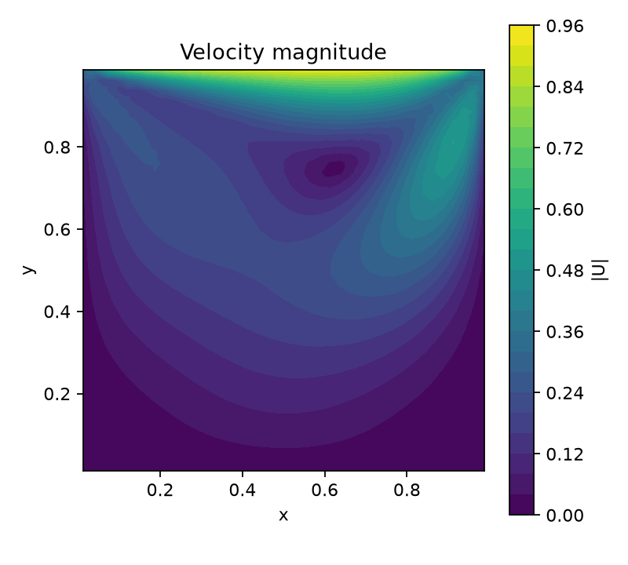

# OpenFOAM CFD MiniLab: Lid-Driven Cavity at Re = 100

This repository is a compact OpenFOAM CFD mini-project for the classical lid-driven cavity problem at Reynolds number 100. It demonstrates a complete traditional CFD workflow: mesh generation, mesh checking, transient incompressible solving, residual monitoring, final-time field post-processing, centerline velocity extraction, and cloud reproduction through GitHub Actions.

The project is intentionally small. Its purpose is to document a reproducible OpenFOAM workflow, not to provide a production CFD solver or benchmark-grade validation.

## What This Project Demonstrates

- OpenFOAM case setup for a 2D laminar lid-driven cavity.
- Structured mesh generation with blockMesh.
- Mesh-quality inspection with checkMesh.
- Transient incompressible solving with icoFoam.
- Residual parsing from the solver log.
- Python post-processing of final-time velocity fields.
- Nearest-cell centerline velocity extraction.
- Reproducible cloud execution using GitHub Actions and an OpenFOAM Docker image.

## Generated Results

The tracked outputs were generated by the GitHub Actions reproduction workflow using OpenFOAM Foundation v11.

- blockMesh generated the default 40 x 40 x 1 structured cavity mesh with 1600 cells.
- checkMesh reports Mesh OK.
- icoFoam advances the case to Time = 5s and exits normally.
- results/residuals.csv stores parsed residual histories from icoFoam.log.
- results/centerline_u.csv and results/centerline_v.csv store nearest-cell centerline velocity profiles from final-time OpenFOAM field output.
- figures/cavity_residuals.png
- figures/cavity_centerline_profiles.png
- figures/cavity_velocity_magnitude.png

The centerline profiles are diagnostic outputs extracted from final-time cell-centered values. They are not intended as benchmark-grade validation against reference cavity-flow data. These executed solver results document the workflow behavior for the tracked case.







## Governing Equations

The case solves the incompressible laminar Navier-Stokes equations:

```text
div(U) = 0
dU/dt + div(U U) = -grad(p) + nu laplacian(U)
```

Here, `U` is the velocity field, `p` is the pressure variable, and `nu` is the kinematic viscosity.

## Physical Setup

- Unit square cavity.
- Effective 2D treatment with a thin z direction and empty front/back patches.
- Lid velocity `U = (1, 0, 0)`.
- Characteristic length `L = 1`.
- Kinematic viscosity `nu = 0.01`.
- Reynolds number `Re = 100`.
- Solver: `icoFoam`.
- OpenFOAM Foundation v11 uses `constant/physicalProperties`.
- `constant/transportProperties` is retained for compatibility with OpenFOAM variants that still read it.

## Mesh

- Default 40 x 40 x 1 mesh.
- Optional 20 x 20 x 1 mesh.
- Mesh dictionaries are provided as `blockMeshDict.20x20` and `blockMeshDict.40x40`.
- `run_cavity.sh` selects and copies the mesh dictionary before running the case.
- Generated mesh and time directories are reproducible and ignored by git.

## Boundary Conditions

- Top moving wall.
- Bottom, left, and right no-slip walls.
- `frontAndBack` empty patches.
- Pressure uses `zeroGradient` on walls.
- Pressure reference settings use `pRefCell 0` and `pRefValue 0`.

## Reproduction

Local execution requires an OpenFOAM-enabled shell.

```bash
bash scripts/run_cavity.sh
MESH_RESOLUTION=20 bash scripts/run_cavity.sh
MESH_RESOLUTION=40 bash scripts/run_cavity.sh
python scripts/check_outputs.py
bash scripts/clean_case.sh
```

## Cloud Reproduction with GitHub Actions

Cloud reproduction with GitHub Actions is configured in `.github/workflows/reproduce.yml`. The workflow runs the case using the OpenFOAM 11 Docker image. It runs blockMesh, checkMesh, and icoFoam, then runs Python post-processing and output validation. The core OpenFOAM sequence is `blockMesh/checkMesh/icoFoam`. The workflow uploads `results/` and `figures/` as downloadable run outputs named `openfoam-cavity-results`.

## Output Files

Required outputs:

- results/logs/blockMesh.log
- results/logs/checkMesh.log
- results/logs/icoFoam.log
- results/residuals.csv
- results/centerline_u.csv
- results/centerline_v.csv
- figures/cavity_residuals.png
- figures/cavity_centerline_profiles.png

Optional outputs:

- results/logs/writeCellCentres.log
- results/logs/foamToVTK.log
- figures/cavity_velocity_magnitude.png

## Limitations

- The default mesh is a modest 40 x 40 teaching mesh, not a grid-convergence study.
- Centerline profiles use nearest-cell extraction from final-time cell-centered values.
- The project is a controlled workflow demonstration, not benchmark-grade validation or a production CFD solver.
- ParaView is recommended for richer field inspection.
